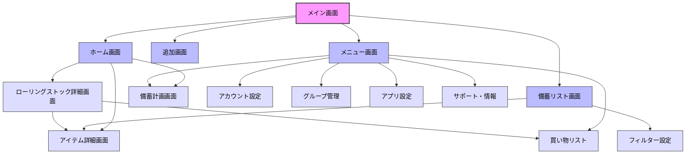

# リストック アプリ ナビゲーションUI設計

このドキュメントでは、メインのナビゲーションUI設計を行います。
個々の画面の詳細設計やその他のUI設計は別ドキュメントで行います。

## 1. 基本ナビゲーション構成

ユーザーが主要機能にアクセスしやすく、かつ情報過多にならないよう、以下の4タブ構成のボトムナビゲーションバーを基本とします。

1.  **ホーム (Home)**
2.  **備蓄リスト (Stock List)**
3.  **追加 (Add Item)**
4.  **メニュー (Menu)**

ローリングストック機能は非常に重要ですが、独立したタブは設けず、ホーム画面で注意喚起し、詳細画面へ誘導する形式を採用します。

## 2. 各タブの詳細

### 2.1. ホーム (Home)

* **役割:** アプリのダッシュボード。最重要情報（特に期限関連）の確認と、主要アクションへの起点。
* **表示内容:**
    * **期限アラート (最重要):**
        * 「まもなく期限切れ X件」 (タップでローリングストック詳細画面へ)
        * 「すでに期限切れ Y件」 (タップでローリングストック詳細画面へ)
        * 特に期限が近いアイテムを数件ピックアップ表示 (タップでアイテム詳細へ)
    * **在庫アラート:**
        * 「在庫わずか Z件」 (タップで買い物リスト / 備蓄リストへ)
    * **備蓄状況サマリー:**
        * 目標に対する備蓄達成度 (%) やグラフ (タップで備蓄計画画面へ)
    * **クイックアクション:**
        * バーコード読み取りボタン (「追加」タブへのショートカット)
    * **お知らせ・Tips:**
        * 運営からのお知らせ、Tips、グループからの通知など。
* **アイコン案:** 🏠 (家), 📊 (ダッシュボード), 🐿️ (キャラクター)

### 2.2. 備蓄リスト (Stock List)

* **役割:** 登録されている全備蓄品の確認と管理。
* **表示内容:**
    * **全アイテム一覧表示 (デフォルト):** 写真、品名、残り日数/期限、数量、場所などをリスト表示。
    * **フィルタリング機能:** 画面上部に「絞り込み」ボタンを設置。タップすると、以下の条件で絞り込めるメニューを表示。
        * 保管場所 (複数選択可)
        * カテゴリ (複数選択可)
        * 期限 (期限切れ、7日以内、30日以内など)
        * 消費済み/未消費
    * **並び替え機能:** 期限順、登録順、名前順などで並び替え。
    * **検索バー:** 品名などで検索。
    * アイテムタップで詳細画面へ遷移。
* **アイコン案:** <0xF0><0x9F><0xA7><0xB1> (棚), <0xF0><0x9F><0x93><0x9C> (リスト), <0xF0><0x9F><0x93><0xA6> (箱)

### 2.3. 追加 (Add Item)

* **役割:** 新しい備蓄品を登録する機能への入口。
* **表示内容:**
    * バーコード読み取りボタン (最も目立つ位置に)
    * 手動入力への導線
    * よく追加するアイテムの履歴/テンプレート
* **アイコン案:** ➕ (プラス), <0xE2><0x8F><0xB9>️ (バーコード)

### 2.4. メニュー (Menu)

* **役割:** アプリ全体の設定、アカウント情報、付帯機能（グループ、買い物リストなど）へのアクセス。
* **表示内容 (リスト形式で表示し、各項目から詳細画面へ):**
    * アカウント設定 (プロフィール、課金状況)
    * グループ管理 (招待、メンバーリスト、設定)
    * 買い物リスト
    * 備蓄計画 (家族構成設定、推奨リスト確認)
    * アプリ設定 (通知、場所/カテゴリ管理、データ)
    * サポート・情報 (ヘルプ、FAQ、規約など)
* **アイコン:** , ⚙️ (歯車)

## 基本ナビゲーション以外の画面

### ローリングストック詳細画面

* **アクセス方法:** ホーム画面の期限アラート部分をタップ。
* **役割:** 期限が近いアイテムに特化し、消費・補充アクションを支援する。
* **表示内容:**
    * 「まもなく期限」リスト (期間別表示: 7日以内、30日以内など)
    * 「消費推奨」リスト
    * 「期限切れ」リスト
    * 各アイテムに「消費した」「買い物リストに追加」ボタンを配置。
    * (発展) レシピ提案へのリンク。

この構成により、ユーザーは日常的にホーム画面で重要な期限情報を確認し、必要に応じて詳細なリスト確認やアイテム追加、設定変更を行えるようになります。

## 3. 画面遷移図

この構成により、ユーザーは日常的にホーム画面で重要な期限情報を確認し、必要に応じて詳細なリスト確認やアイテム追加、設定変更を行えるようになります。
